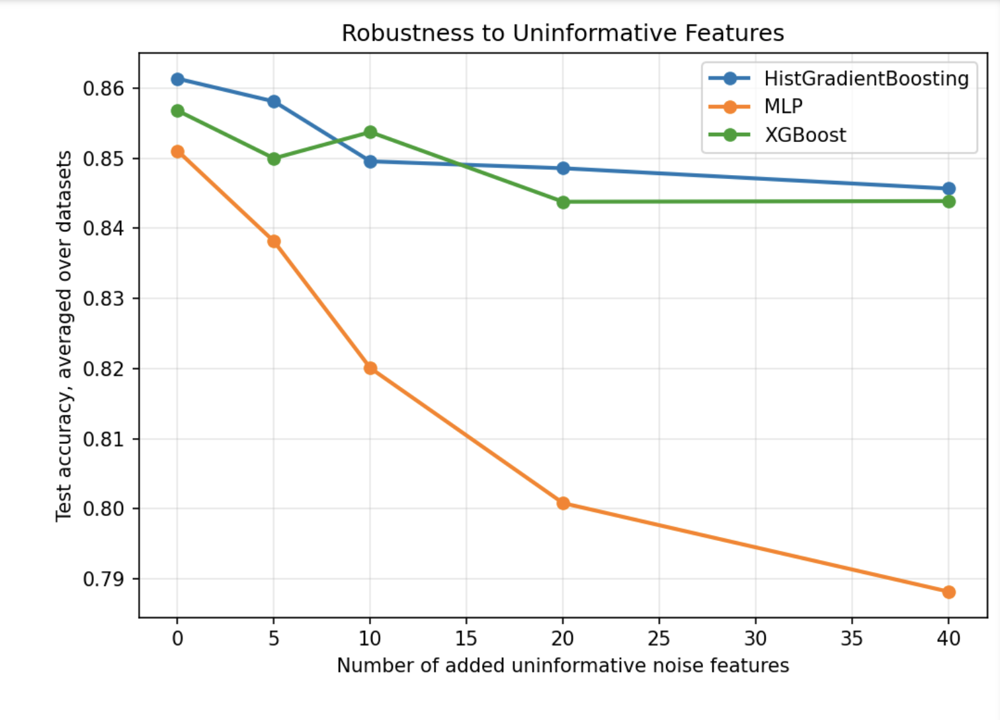

<div align="center">


### 🌲 Do tree ensembles *really* still beat neural networks on tabular data?

<br/>


<br/>


<br/>

*A from-scratch reproduction of the benchmark methodology in **Grinsztajn, Oyallon & Varoquaux (NeurIPS 2022)**, plus an original ablation testing one of the paper's core scientific claims.*

</div>

---

## 🏁 TL;DR — the headline

> On this reduced benchmark, tree-based models and a **properly-preprocessed MLP reach comparable raw accuracy**.
> The trees win decisively on the two axes the paper actually emphasizes:
> ⚡ **training speed (~20× faster)** and 🛡️ **robustness to uninformative features (~4× less degradation)**.

That nuance — *not* a simple "trees win" — is the most interesting thing this project found, and it only surfaced after fixing a preprocessing bug in my own deep model. More on that in [What I learned](#-what-i-learned).

---

## ⚡ Project overview


The original paper is **not a new-model paper**. Its contributions are (a) a rigorous benchmark for tabular data and (b) an empirical investigation into *why* tree ensembles beat neural networks on it. Reproducing it therefore means rebuilding the **pipeline**, not implementing a novel architecture:

| # | Stage | Paper ref |
|:-:|---|---|
| 1️⃣ | Curate + preprocess datasets under fixed rules | Sec. 3.2, 3.5 |
| 2️⃣ | Random hyperparameter search, selecting on a **validation** set | Sec. 3.3 |
| 3️⃣ | Report the **test** score of the validation-selected config | Sec. 3.3 |
| 4️⃣ | Normalize scores **per dataset** so they can be averaged | Sec. 3.4 |
| 5️⃣ | Plot normalized score vs. search budget, error bars from reshuffling | Fig. 1 |

This repo implements all five, compares trees against a deep baseline, then goes **beyond the paper** with a noise-feature ablation.

📄 **Original paper:** [arXiv:2207.08815](https://arxiv.org/abs/2207.08815) · 💻 **Original code:** [LeoGrin/tabular-benchmark](https://github.com/LeoGrin/tabular-benchmark)
📁 Local copy: `paper/paper.pdf` · 📝 Reading notes: `notes/summary.md`

---

## 📊 Datasets

Three numerical-only binary classification datasets from the paper's suite, pulled from **OpenML** at runtime (not committed to the repo).

| Dataset | Rows after preprocessing | Features | Used in |
|---|---:|---:|---|
| 🔭 `MagicTelescope` | 13,376 | 10 | Phases 1–5, ablation |
| ⚡ `electricity` | 10,000 train (truncated) | 7 | Phase 4 |
| 🔊 `phoneme` | 3,172 | 5 | Phase 5, ablation |

<details>
<summary><b>🔧 Preprocessing rules (click to expand)</b></summary>

<br/>

Faithful to the paper:

- Drop non-numeric columns (numerical-only setting)
- Drop columns with >50% missing, then any remaining rows containing NaNs
- Drop numerical features with <10 unique values
- Binarize the target to the **two most frequent classes**, balanced 50/50
- Truncate the **training set only** to 10,000 samples (medium-sized regime)
- Neural nets additionally get features Gaussianized with `QuantileTransformer(output_distribution="normal")` — Sec. 3.5

</details>

---

## 🚀 Setup

```bash
git clone <this-repo> && cd project
python -m venv .venv && source .venv/bin/activate    # Windows: .venv\Scripts\activate
pip install -r requirements.txt
```

> 🍎 **macOS note:** if XGBoost fails with a `libomp` / OpenMP error, run `brew install libomp` (or `conda install -c conda-forge xgboost`). The code degrades gracefully and simply skips XGBoost if it can't be imported.

<details>
<summary><b>▶️ Running the experiments (click to expand)</b></summary>

<br/>

```bash
# 🧪 Milestone checks
python src/run_phase1.py --synthetic          # pipeline smoke test, no network needed
python src/run_phase2.py                       # all tree models, default hyperparameters

# 🌲 Core reproduction
python src/run_phase3.py --n-iter 30           # random search on one dataset
python src/run_phase4.py --datasets MagicTelescope electricity phoneme \
    --models RandomForest HistGradientBoosting XGBoost --n-iter 30

# 🌲 vs 🧠 Tree vs deep
python src/run_phase5.py --datasets MagicTelescope phoneme \
    --models HistGradientBoosting XGBoost MLP --n-iter 15

# 🔬 Extension: noise-feature ablation
python src/run_ablation.py --datasets MagicTelescope phoneme \
    --models HistGradientBoosting XGBoost MLP --k-values 0 5 10 20 40 --n-iter 10
```

Then turn the saved raw records into the results tables:

```python
from reporting import summarize
summarize("results/phase5_raw_records.csv")
```

</details>

---

## 📈 Results

### 🖥️ Hardware

macOS (Darwin, x86_64, Intel) · **CPU-only** · Python 3.13.5 · scikit-learn 1.6.1 · XGBoost 2.1.1 · PyTorch 2.5.1 *(CUDA ❌, MPS ❌)*

### 🌲 Tree-model benchmark — Figure 1 reproduction

`3 datasets × 3 models × 30 random-search iterations × 15 shuffles`

| 🏅 | Model | Normalized score | Range across shuffles |
|:-:|---|---:|---|
| 🥇 | HistGradientBoosting | **0.912** | [0.755, 1.000] |
| 🥈 | XGBoost | 0.820 | [0.764, 0.929] |
| 🥉 | RandomForest | 0.737 | [0.509, 0.885] |

Boosted trees lead, RandomForest trails — ✅ consistent with the paper.

### 🌲 vs 🧠 Tree vs deep

`2 datasets × 3 models × 15 iterations` — **raw** test performance of the validation-selected config:

| Model | Type | Mean accuracy | Mean macro-F1 | ⏱️ Mean fit time |
|---|:-:|---:|---:|---:|
| XGBoost | 🌲 tree | **0.8645** | 0.8644 | **0.209 s** |
| MLP | 🧠 deep | 0.8621 | 0.8619 | 4.242 s |
| HistGradientBoosting | 🌲 tree | 0.8616 | 0.8616 | 0.500 s |

Corresponding **normalized** scores: HistGradientBoosting `0.803` · XGBoost `0.731` · MLP `0.622`

> ⚠️ **These two views tell different stories, and the difference matters.**
> On raw accuracy the MLP is statistically tied with the trees — it even edges out HistGradientBoosting. The normalized metric amplifies small within-dataset gaps, so it ranks the MLP well below. **Reporting only the normalized ranking would overstate the result.** What *is* unambiguous is cost: the MLP takes **~20× longer per fit** than XGBoost for no accuracy gain.

📌 Macro-F1 tracks accuracy almost exactly — expected, since targets are balanced 50/50 by construction.

---

## 🔬 Extension: robustness to uninformative features


The paper's **Finding 2** (Fig. 4b) claims MLP-like networks degrade faster than trees as uninformative features are added. I tested this directly: append *k* standard-Gaussian noise columns (uncorrelated with the target) for `k = 0, 5, 10, 20, 40`, then re-run the **unchanged** benchmark protocol at each *k*.

Accuracy drop from `k=0` → `k=40`, averaged over both datasets:

| Model | k=0 | k=40 | 📉 Drop |
|---|---:|---:|---:|
| 🌲 XGBoost | 0.8568 | 0.8439 | **0.0129** |
| 🌲 HistGradientBoosting | 0.8614 | 0.8457 | **0.0157** |
| 🧠 MLP | 0.8511 | 0.7882 | **0.0629** 🔴 |

The MLP degrades roughly **4× faster** than either tree model, **monotonically across all five values of *k***. This independently reproduces the paper's finding with my own code — and it *explains* the accuracy story above: the MLP can match trees on clean features, but real tabular data is full of uninformative columns, and that's where it falls apart.



---

## 🔍 Comparison with the paper

| Aspect | 📄 Paper | 🔁 This reproduction |
|---|---|---|
| Datasets | 45 | 3 |
| Search budget | ~400 iterations | 10–30 iterations |
| Deep models | MLP, ResNet, FT-Transformer, SAINT | MLP *(ResNet implemented, not benchmarked)* |
| Tasks | Classification + regression | Classification only |
| Compute | 20,000 compute hours | CPU-only laptop, single seed |
| Trees > deep on **accuracy** | ✅ clear gap | ⚖️ tied on raw accuracy |
| Trees > deep on **speed** | ✅ | ✅ ~20× |
| MLPs hurt by **noise features** | ✅ | ✅ ~4× steeper degradation |

<details>
<summary><b>⚠️ Known differences from the paper's methodology (click to expand)</b></summary>

<br/>

- **Hyperparameter spaces are approximations**, not the exact grids from Appendix A.3 / the original repo.
- **The MLP is simplified:** fixed 30 epochs, AdamW, *no* early stopping and *no* `ReduceLROnPlateau` scheduler (the paper uses one). This likely under-trains it, and is the single most plausible reason the accuracy gap is smaller here than in the paper.
- **Search budget is 10–30× smaller.** At this budget, curves are noisy and small ranking differences are not meaningful.
- **Single seed (0).** Ribbons in the figures are wide; the ordering of closely-matched models could shift under a different seed.
- **Missing-data threshold** (drop columns >50% missing) is my choice; the paper does not specify one.
- **Class balancing** downsamples the majority class to match the minority — matching the paper's "keep half of samples in each class."

</details>

---

## 💡 What I learned


The most valuable lesson: **a normalized metric can tell a different story than the raw one, and you have to look at both.**

My first tree-vs-deep run put the MLP at `0.393` normalized — which looked like a decisive win for trees. But the *raw* accuracies revealed something else: an under-trained network, not a paper-confirming result. The culprit was preprocessing — I had used `StandardScaler` where the paper specifies `QuantileTransformer`. Fixing it lifted the MLP to **parity on accuracy**, and only *then* did the real tree advantages — speed and noise-robustness — become the honest headline.

Other takeaways:

- 🧰 Reproducing a benchmark paper is mostly **evaluation engineering**, not modeling.
- 🚧 The *"select on validation, report on test"* discipline is easy to state and easy to violate.
- ⚙️ The paper's trick of running the search **once** and reshuffling the *saved* results post-hoc (rather than refitting) is what makes 15 error-bar replicates affordable.

---

## 🔮 Future improvements

- 🎲 **Multiple seeds.** Rerun the ablation with `--seeds 0 1 2` for error bands, confirming the 4× effect isn't seed-specific.
- 🧠 **Train the MLP properly.** Add early stopping + `ReduceLROnPlateau`, then re-check whether the accuracy gap reopens in the paper's direction.
- 🏗️ **Benchmark the ResNet.** It's implemented in `src/nn_models.py` but never included in a run.
- 📉 **Regression half of the paper.** Machinery (R², target log-transform) is scoped for but not implemented.
- 🧪 **The paper's other findings:** target smoothing (Finding 1) and random rotations (Finding 3).
- 🔁 **Larger search budget** (100+ iterations) for smoother, more trustworthy Figure 1 curves.

---

## 🗂️ Repository structure

```
project/
├── 📄 paper/paper.pdf              # the original paper
├── 📝 notes/summary.md             # reading notes, four-question summary
├── 🐍 src/
│   ├── data.py                     # OpenML loading + paper's preprocessing
│   ├── models.py                   # model registry (trees + optional deep)
│   ├── nn_models.py                # PyTorch MLP / ResNet + sklearn-style wrapper
│   ├── search_spaces.py            # per-model hyperparameter spaces
│   ├── random_search.py            # select-on-validation; records acc, F1, time
│   ├── benchmark.py                # normalization, shuffles, aggregation, plots
│   ├── reporting.py                # results tables (accuracy / F1 / time / params)
│   ├── ablation.py                 # 🔬 noise-feature extension
│   └── run_phase{1..5}.py, run_ablation.py
├── 📊 results/                     # figures + raw records (generated)
└── 📦 requirements.txt
```

---

<div align="center">

**Reproduction of** *Grinsztajn, L., Oyallon, E., & Varoquaux, G. (2022).*
*Why do tree-based models still outperform deep learning on typical tabular data?* — NeurIPS 2022, Datasets & Benchmarks Track.


</div>
